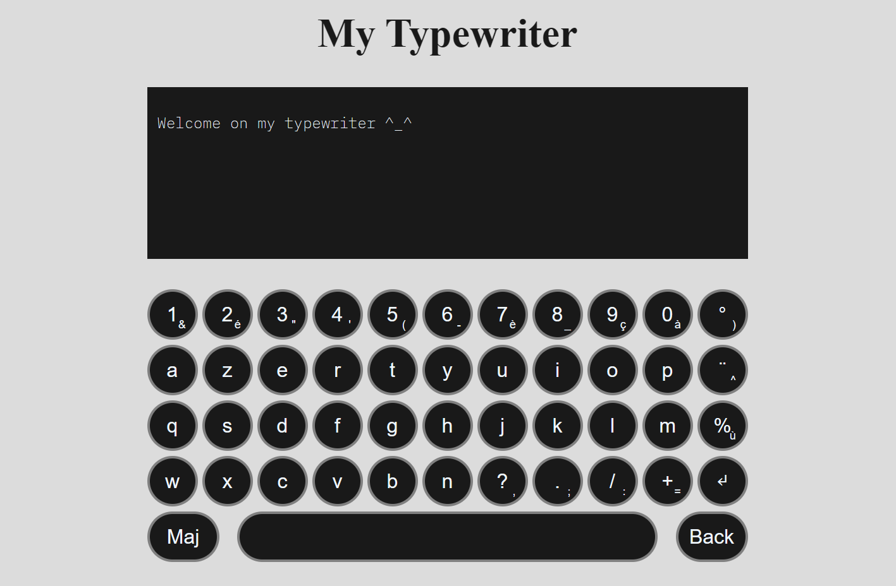

# Typewriter

## Aperçu du projet

## Présentation

Réalisation d'un projet en HTML, CSS, et JavaScript vanilla.

Ce projet vient simuler un clavier numérique où l'utilisateur va pouvoir venir actionner les touches pour venir écrire, et afficher le texte dans la partie supérieure de l'écran.
